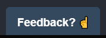
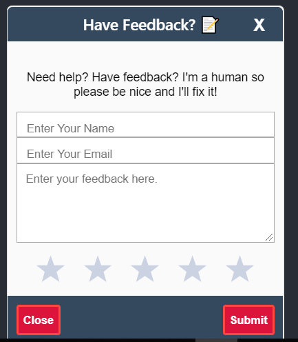
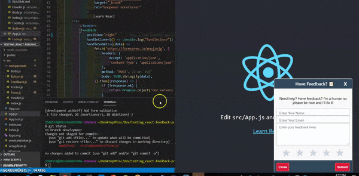

This project was bootstrapped with [Create React App](https://github.com/facebook/create-react-app) and [this React Feedback Component](https://www.npmjs.com/package/react-feedback)

[](https://travis-ci.org/ya332/react-made-by)
[](https://github.com/prettier/prettier)
<a href="https://codeclimate.com/github/ya332/react-feedback-popup/maintainability"></a>
[](https://github.com/ya332/react-made-by/blob/master/CONTRIBUTING.md)


<a href="https://www.buymeacoffee.com/ya332" target="_blank"></a>

# React-Feedback-Popup

React-Feedback-Popup is balzingly fast and highly customizable component to get user feedback.

Collapsed Feedback Popup:


Expanded Feedback Popup:


### Features

- Gets user name, email, rating.
- User can determine the position (left or right)
- User can determine the header, body, and button text as well as the number of star ratings.
- Form validation (name, email, feedback and rating are required)

### Why

I needed a "feedback component" for my [projects](http://ya332.github.io#projects). Since I was unable to find one which met my requirements (and the fact that I generally enjoy re-inventing the wheel) this is what I came up with.

### Demo




### Installation

The preferred way of using the component is via NPM

```
npm install --save react-feedback-popup
```

### Usage

Here's a sample implementation that creates the "Made By {NAME}" the component on default Create-React-App page.

```javascript
import React from 'react';
import logo from './logo.svg';
import FeedBack from 'react-feedback-popup';
import './App.css';

function App() {
	return (
		<div className="App">
			<header className="App-header">
				
				<p>
					Edit <code>src/App.js</code> and save to reload.
        </p>
				<a
					className="App-link"
					href="https://reactjs.org"
					target="_blank"
					rel="noopener noreferrer"
				>
					Learn React
        </a>
			</header>
			<FeedBack
				position="left"
				numberOfStars={5}
				headerText="Hello"
				bodyText="Custom Body test"
				buttonText="This is also custom"
				handleClose={() => console.log("handleclose")}
				handleSubmit={(data) => 
					fetch('https://formspree.io/moqjznjg', {
						headers: {
							Accept: 'application/json',
							'Content-Type': 'application/json'
						},
						method: 'POST', // or 'PUT'
						body: JSON.stringify(data),
					}).then((response) => { 
						if (!response.ok) {
							return Promise.reject('Our servers are having issues! We couldn\'t send your feedback!');
						}
						response.json()
					}).then(() => {
						alert('Success!');
					}).catch((error) => {
						alert('Our servers are having issues! We couldn\'t send your feedback!', error);
					})
				}
				handleButtonClick={() => console.log("handleButtonClick")}
			/>
		</div>
	);
}

export default App;

```


<a name="Options"></a>

### Options

| Option                                |  Type    | Default                 | Description                                                     	|
| ------------------------------------- | -------- | ----------------------- | --------------------------------------------------------------  	|
| [`position`](#tagsOption)             | `String` | `right` | Position of the feedback pop. Possible options are `right` and `left`                                             |
| [`numberOfStars`](#suggestionsOption) | `Integer` | `5`                    | Number of rating stars to be displayed.                 	| 
| [`headerText`](#delimiters)             | `String` | `"Have Feedback? 📝?"`                    | Text to be displayed on header when pop is expanded.          |
| [`bodyText`](#delimiters)               | `String` | `"Need help? Have feedback? I'm a human so please be nice and I'll fix it!"`                  | Text to be displayed on on the body when pop is expanded        			    |
| [`buttonText`](#delimiters)             | `String` | `"Feedback? ☝️"`                  | Text to be displayed on header when pop is no expanded         			|
| [`handleClose`](#delimiters)            | `Function` | `This function collapses the popup`                  | Called when `close button` is clicked.   					|
| [`handleSubmit`](#delimiters)           | `Function` | `alert('Success!') or alert('Error')`                  | Called when `submit button` is clicked.    					|
| [`handleButtonClick`](#delimiters)      | `Function` | `()`                  | Called when user clicks on Feedback button to expand the popup.               	    |

Sample Usage:

```js
<FeedBack
	position="left"
	numberOfStars={5}
	headerText="Hello"
	bodyText="Custom Body test"
	buttonText="This is also custom"
	handleClose={() => console.log("handleclose")}
	handleSubmit={(data) => 
		fetch('https://formspree.io/moqjznjg', {
			headers: {
				Accept: 'application/json',
				'Content-Type': 'application/json'
			},
			method: 'POST', // or 'PUT'
			body: JSON.stringify(data),
		}).then((response) => { 
			if (!response.ok) {
				return Promise.reject('Our servers are having issues! We couldn\'t send your feedback!');
			}
			response.json()
		}).then(() => {
			alert('Success!');
		}).catch((error) => {
			alert('Our servers are having issues! We couldn\'t send your feedback!', error);
		})
	}
	handleButtonClick={() => console.log("handleButtonClick")}

/>
```

### Dev

The component is written in ES6 and uses [Webpack](http://webpack.github.io/) as its build tool.

#### Set up instructions

```
git clone git@github.com:ya332/react-made-by.git
cd react-made-by
npm install
npm run start
```
open [http://localhost:3000](http://localhost:3000)


### Contributing

Got ideas on how to make this better? Open an issue [here!](https://github.com/ya332/react-made-by/issues/new)

Also thanks to the awesome contributors who've made the library far better!

[default-suggestions-filter-logic]: https://github.com/ya332/react-made-by/blob/v4.0.1/lib/MadeBy.js#L83
[includes-polyfill]: https://github.com/mathiasbynens/String.prototype.includes
